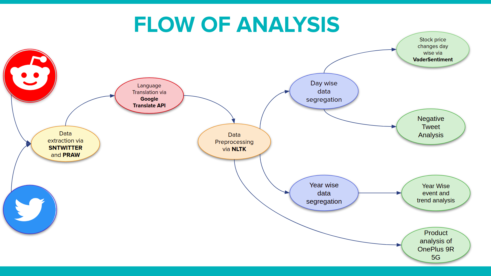
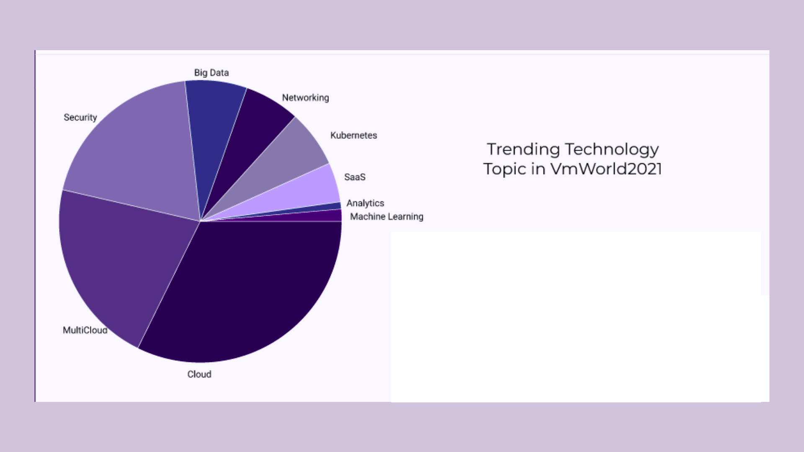
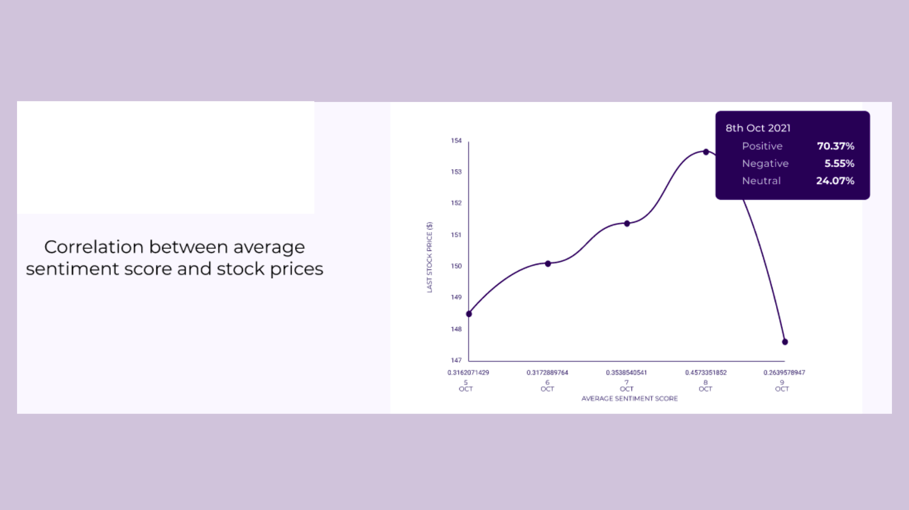
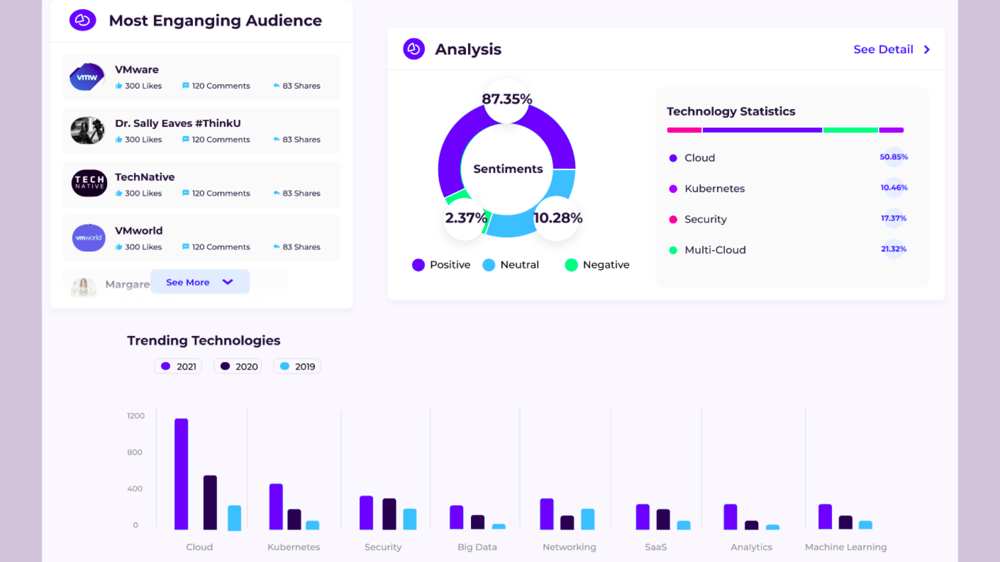
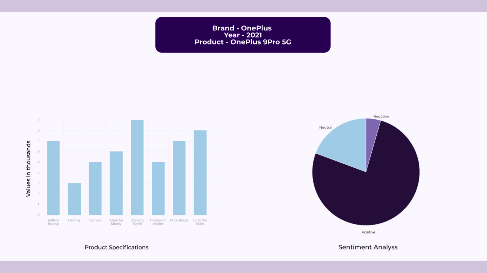

# VMware CodeHouse India 2021 - **Reach++**

### **Analyzing social media to get insights into industry trends and leveraging to increase brand equity**

In the era of the Internet and people being able to express their views openly or anonymously about anything and everything, understanding what the audience is thinking about the brand becomes of utmost importance.
Our idea is a step towards gathering insights from the massive amount of information available on the internet including but not limited to social media.
It revolves around analyzing social media to get insights into industry trends and leveraging them to increase brand equity, customer satisfaction and retention and analyze market trends.
We have focussed on 3 major pillars of web intelligence: 
- **Brand Monitoring**: We have analysed the VMworld event and gathered the top trending technologies from the past 3 years. This visualization can be extended to any event of any company.
- **Market Research and Trends**: Analysis of how people were reacting on the ongoing event “VMWorld 2021” and its effects on stock prices
- **Product Analysis**: We have analysed consumer sentiments for a particular product to gather insights into the most liked and and later can be extended to any product. 
- We have also worked towards understanding the negative sentiments in various tweets and tried to analyze issues customers face.

### Analysis Results - I (Topic Distribution)

### Analysis Results - II (Correlation between sentiment scores and VMware stock prices)

### Analysis Results - III (Topic trend analysis - over the years)

### Analysis Results - IV (Product Analysis)

### [Demo video link](https://drive.google.com/file/d/1FnpGj0JZad0u5Qvdc1JwW07aHyQwN-cx/view?usp=sharing)
